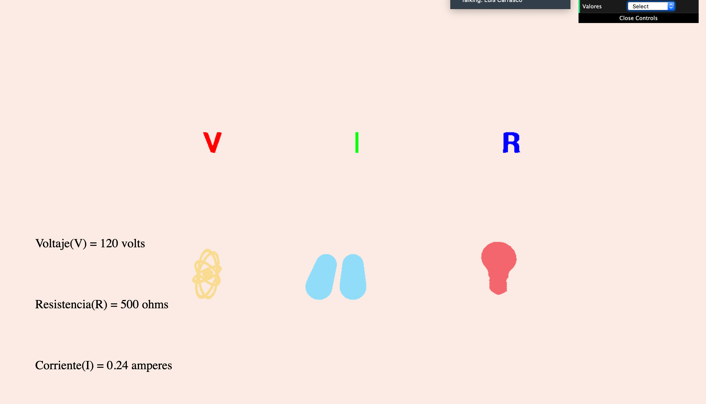

### Proyecto Final Gráficas Computacionales
Este proyecto es una implementación de la Ley de Ohm en una aplicación web y fue creado utilizando WebGL a través del framework de Three JS

[WebGL](https://get.webgl.org)

[Three Js](https://threejs.org)

---
#### Ley de Ohm:
La corriente que circula por un circuito eléctrico varía de manera directamente proporcional a la diferencia de potencial, e inversamente proporcional con la resistencia del circuito.
 
 [Video de aprendizaje](https://www.youtube.com/watch?v=m7HY1Or01S0)

---
#### Deployment

Para correr el simulador se debe hacer desde un server local, nosotros utilizamos la extension de chrome [200 OK!](https://chrome.google.com/webstore/detail/web-server-for-chrome/ofhbbkphhbklhfoeikjpcbhemlocgigb) o [Node Server](https://www.npmjs.com/package/http-server)

Para correr el proyecto en node se debe de correr el siguiente comando desde la ruta raíz del proyecto:

`$ http-server`

Se accede a la ruta localhost indicada por el server (se recomienda usar FireFox)

---
#### Instrucciones en el proyecto

1) Camera control:

    * Rotar: Arrastar + botón izquierdo del ratón 
    * Zoom: Arrastrar + rueda del ratón
    
2) Controlador :
    * Verás este controlador en la esquina superior derecha, al dar click muestra la lista de valores a calcular.
    * Seleccionas el valor a calcular ya sea el voltaje, corriente o la resistencia
    * Aparecerán 2 cuadros de diálogo para que ingreses los valores.
    
3) Resultados:

   * Una vez ingresados los valores, se realizan los calculos necesarios y en la pantalla además de aparecer la solución, las letras cambian de tamaño para indicar su comportamiento
   * La iluminación también cambia segun los valores.

----
By

- `@memoherreraacosta`
- `@danzav`
- `@LivierAB`

[Documento Entregable](./files/entregable.pdf)   

May the `Force` be with you
